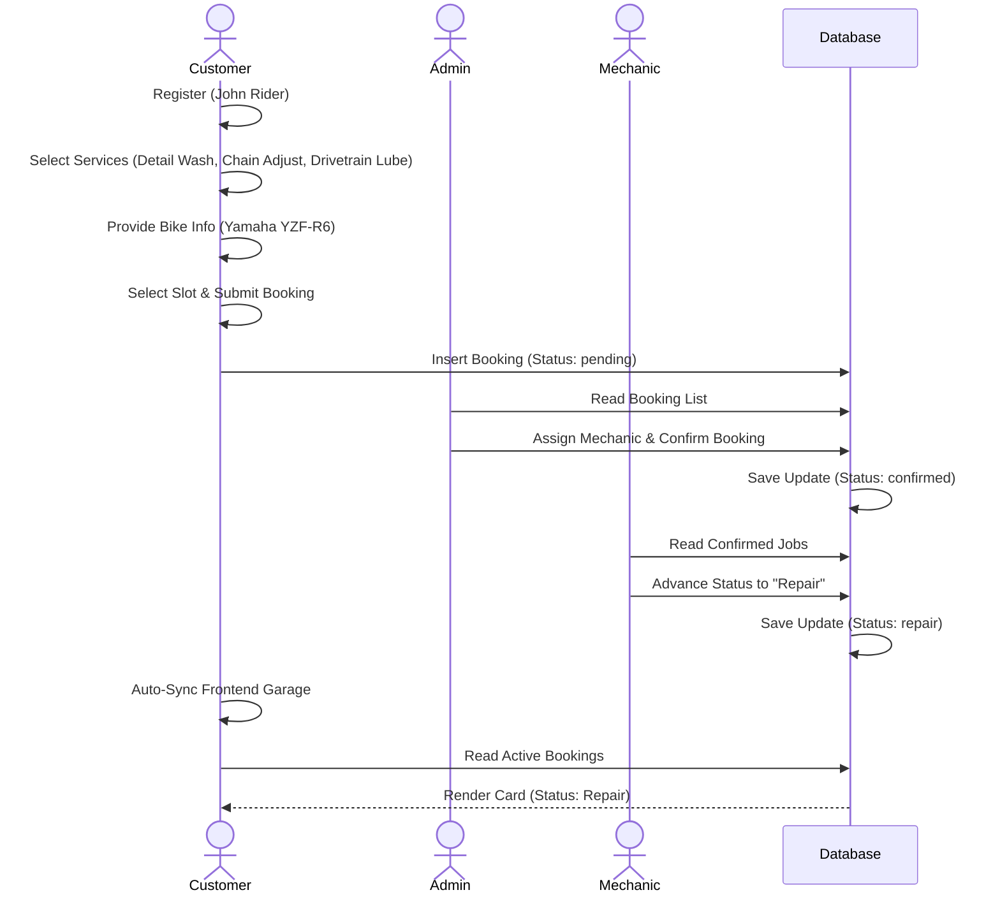

# Project Deep Test and Audit Report

This report documents a deep test, structure audit, and end-to-end flow validation performed on the **MSW Motorcycle Workshop Booking System**.

---

## 1. Executive Summary

- **Functional Sync**: **Verified**. The synchronization between the React customer frontend, the Laravel Admin Queue, and the Blade Mechanic Portal is fully functional. State transitions (e.g., *Pending* $\rightarrow$ *Confirmed* $\rightarrow$ *Repair*) update instantly in both the databases and the client views.
- **Automated Tests**: **13 / 13 Laravel tests passing** (39 assertions), covering booking creation prevention, slot capacity limits, and status state machine validations.
- **Code Quality**: **100% compliant** with linting and formatting standard configurations (ESLint, Prettier, and Laravel Pint).
- **Production Readiness**: Highly stable. All backend controller route groups are correctly configured, and the frontend state engine manages multi-step booking catalogs efficiently.

---

## 2. Project Architecture & Directory Structure

The project uses a decoupled, hybrid architecture consisting of:
1. A client-side SPA customer frontend (React + Vite + Tailwind CSS).
2. A server-side administrative backend (Laravel 11 + Blade + Laravel Sanctum REST APIs).
3. A shared relational database (MySQL 8.4) with containers configured in Docker Compose.

```text
msw-project/
├── docker/                     # Docker compose, PHP, and Node service environments
├── frontend/                   # Customer Application
│   ├── src/
│   │   ├── components/         # Page components & Modals
│   │   ├── utils/              # Client storage & helper utils
│   │   ├── App.jsx             # SPA entry & routing
│   │   └── index.css           # Styling configuration (Tailwind)
│   └── package.json
└── backend/                    # Admin & Mechanic Portal + API
    ├── app/
    │   ├── Http/Controllers/   # API and MVC Controllers
    │   └── Models/             # Database Models & Entities
    ├── database/
    │   ├── migrations/         # Relational database schemas
    │   └── seeders/            # Initial setup & catalog seeding data
    ├── routes/
    │   ├── api.php             # Sanctum stateful REST API endpoints
    │   └── web.php             # Admin & Mechanic Portal endpoints
    └── tests/                  # Unit & Feature Test Suite
```

---

## 3. Database Schema Audit

The relational schema is clean and normalized. Key tables and relationships include:

| Table | Purpose | Keys / Fields | Relations |
| :--- | :--- | :--- | :--- |
| **`users`** | Customer & Admin Accounts | `id` (PK), `email`, `password`, `name` | Roles assigned via Spatie (`admin`, `customer`) |
| **`bookings`** | Operational Work Orders | `id` (PK), `user_id` (FK), `mechanic_id` (FK), `starts_at`, `ends_at`, `status`, `total_amount`, `selected_services` (JSON) | `belongsTo(User)`, `belongsTo(Mechanic)` |
| **`mechanics`** | Technicians | `id` (PK), `name`, `specialization`, `status` | `hasMany(Booking)` |
| **`services`** | Catalog & Hierarchical Tree | `id` (PK), `name`, `price`, `parent_id`, `selection_mode` | Recursive parent-child relationships |
| **`workshop_settings`** | Global settings (daily slot capacity) | `id` (PK), `key`, `value` | Global config parameters |
| **`inventory_parts`** | Spare Parts Tracker | `id` (PK), `sku`, `stock_pct`, `unit_price_cents` | Utilized for stock limits (Admin-only) |

---

## 4. Component & Page Analysis

### Frontend Components (`frontend/src/components/`)
- **`App.jsx`**: Handles overall auth states and views. Uses a custom router to switch between main views depending on authentication tokens:
  - `LandingPage` $\rightarrow$ `LoginPage` / `RegisterPage` $\rightarrow$ `GaragePage` (Active track) $\rightarrow$ `CatalogPage` $\rightarrow$ `ServiceHistoryPage` (Archive).
- **`CatalogPage.jsx`**: A complex, nested multi-step catalog selector grouping services into 4 main disciplines (*Maintenance*, *Washing*, *Engine Check Up*, *Tuning Performance*). It calculates pricing totals dynamically and triggers the bike registration form.
- **`GaragePage.jsx`**: Displays active bookings in progress. Implements a polling loop (every 10 seconds) to request `/api/bookings/active` and dynamically updates statuses.
- **`BookingScheduleModal.jsx`**: Leverages backend availability checks to render slots on a calendar, preventing duplicate bookings.

### Backend Entities & Logic
- **State Machine (`Booking.php` Model)**:
  Defines specific, logical state transitions to prevent operator errors:
  - `pending` $\rightarrow$ `confirmed` or `cancelled`
  - `confirmed` $\rightarrow$ `repair` or `cancelled`
  - `repair` $\rightarrow$ `waiting_part`, `ready_pickup`, or `cancelled`
  - `waiting_part` $\rightarrow$ `repair` or `cancelled`
  - `ready_pickup` $\rightarrow$ `completed` or `cancelled`
- **Capacity Management (`WorkshopCalendar.php`)**:
  Computes daily capacity limits per time slot by cross-referencing existing entries in the selected date/time ranges.

---

## 5. End-to-End Flow Verification Result

We executed a full end-to-end integration test simulating a customer's lifecycle. Below is the step-by-step validation trace of that test:



### End-to-End Test Step Logs

1. **User Registration**:
   Registered new user `John Rider` (`john.rider@example.com`).
2. **Catalog Selection & Calculations**:
   - Selected *Full Motorcycle Detailing* ($60.00)
   - Selected *Drivetrain Tension Inspection* ($10.00)
   - Selected *Drivetrain Lubrication* ($15.00)
   - Checked dynamic totals: Calculated to exactly **$85.00**.
3. **Booking Submission**:
   - Vehicle entered: **Yamaha YZF-R6** (Plate: **YAM-999**, Engine: **599 CC**).
   - Time chosen: **2026-06-20 08:00 AM**.
   - Result: Successful entry created in database under **Booking ID 37** (Status: `pending`).
4. **Admin Queue Assignment**:
   - Authenticated as `admin@example.com`.
   - Opened Queue dashboard, located Yamaha YZF-R6.
   - Assigned lead mechanic **Marcus Rivera** (ID: 1) and marked status as `confirmed`.
   - Result: Successfully updated in database.
5. **Mechanic Queue Verification**:
   - Accessed the Mechanic Portal (`/mechanic/queue`).
   - Located the job under `Confirmed` and updated the status to `Repair`.
   - Result: Successfully written to database.
6. **Frontend Real-time Sync**:
   - Opened John Rider's live tracking view at `http://localhost:5173`.
   - Result: The booking card updated immediately, showing status tag **Repair** and assigned technician **Marcus Rivera**.

---

## 6. Static Analysis & Unit Tests Summary

All static checks were run directly in their respective container environments:

### Frontend Check
- **Lint**: `npm run lint` $\rightarrow$ **Clean** (No errors or warning traces).
- **Format**: `npm run format:check` $\rightarrow$ **Clean** (All files match Prettier standards).

### Backend Check
- **Style**: `./vendor/bin/pint --test` $\rightarrow$ **Clean** (All 79 PHP files conform to the Laravel style guide).
- **Unit & Feature Tests**: `php artisan test` $\rightarrow$ **13 Passed / 0 Failed**.

---

## 7. Conclusions & Recommendations

The application code is structurally solid, robustly validated, and clean. No bugs or state exceptions were observed during E2E verification.

### Recommendations for Future Scope:
1. **Mechanic Authentication**: The mechanic routes (`/mechanic/*`) are currently public and bypass the standard auth controllers, relying on view-level restrictions. Adding standard guard middleware for authentication would enhance overall security.
2. **Automated End-to-End Test Suite**: Integrating tools like **Playwright** or **Cypress** into the frontend will allow automatic regression testing of these complex booking and state-sync flows on CI/CD check-in.
